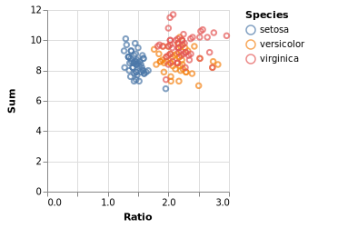

class: middle, centre


# JuliaDBMeta and StatPlots


## Metaprogramming tools for manipulating and visualizing data


Pietro Vertechi, JuliaCon 2018


---


# What is JuliaDBMeta?


--


  * JuliaDBMeta macros (inspired on DataFramesMeta and Query) allow to use the JuliaDB library for table manipulations with a simplified syntax


--


  * JuliaDBMeta operations can be concatenated, mixing and matching with external packages, to create a data analysis pipeline (both in memory and out-of-core)


--


  * JuliaDBMeta pipelines integrate smoothly with several plotting libraries (VegaLite, StatPlots, Gadfly)


--


  * the new Interact package allows to run these manipulations and visualizations from a "hackable" and composable GUI


---


# JuliaDBMeta macros


Roughly two categories:


  * column-wise (user works with columns of the table)
  * row-wise (user works with entries of a row)


---


# Demo


```julia
using JuliaDBMeta
filepath = Pkg.dir("JuliaDBMeta", "test", "tables", "iris.csv")
iris = loadtable(filepath)
```

```
Table with 150 rows, 5 columns:
SepalLength  SepalWidth  PetalLength  PetalWidth  Species
─────────────────────────────────────────────────────────────
5.1          3.5         1.4          0.2         "setosa"
4.9          3.0         1.4          0.2         "setosa"
4.7          3.2         1.3          0.2         "setosa"
4.6          3.1         1.5          0.2         "setosa"
5.0          3.6         1.4          0.2         "setosa"
5.4          3.9         1.7          0.4         "setosa"
4.6          3.4         1.4          0.3         "setosa"
5.0          3.4         1.5          0.2         "setosa"
4.4          2.9         1.4          0.2         "setosa"
⋮
5.8          2.7         5.1          1.9         "virginica"
6.8          3.2         5.9          2.3         "virginica"
6.7          3.3         5.7          2.5         "virginica"
6.7          3.0         5.2          2.3         "virginica"
6.3          2.5         5.0          1.9         "virginica"
6.5          3.0         5.2          2.0         "virginica"
6.2          3.4         5.4          2.3         "virginica"
5.9          3.0         5.1          1.8         "virginica"
```


---


# Column-wise macros: working with columns


Simplest example is `@with`: each symbol gets replaced with the corresponding column.


```julia
@with iris mean(:SepalLength) / mean(:SepalWidth)
```

```
1.911251635412124
```


---


# Column-wise macros: type inferrability


```julia
using Base.Test
f(df) = @with df :SepalLength
@inferred f(iris)
```

```
150-element Array{Float64,1}:
 5.1
 4.9
 4.7
 4.6
 5.0
 5.4
 4.6
 5.0
 4.4
 4.9
 ⋮
 6.9
 5.8
 6.8
 6.7
 6.7
 6.3
 6.5
 6.2
 5.9
```


---


# Row-wise macros: doing things row by row


Simplest example is `@map`: apply a given expression row by row.


```julia
@map iris :SepalLength/:SepalWidth
```

```
150-element Array{Float64,1}:
 1.45714
 1.63333
 1.46875
 1.48387
 1.38889
 1.38462
 1.35294
 1.47059
 1.51724
 1.58065
 ⋮
 2.22581
 2.14815
 2.125
 2.0303
 2.23333
 2.52
 2.16667
 1.82353
 1.96667
```


---


# Row-wise macros: under the hood


```julia
@map iris :SepalLength/:SepalWidth
```


--


  * Construct anonymous function `t -> t.SepalLength / t.SepalWidth`


--


  * Store list of fields that are actually used: `(:SepalLength, :SepalWidth)`


--


  * Return:


```julia
map(t -> t.SepalLength / t.SepalWidth, iris, select = (:SepalLength, :SepalWidth))
```


--


Very important for performance in tables with many columns, as we avoid materializing unnecessary fields!


---


# Row-wise macros: examples


The same trick can be used to add or modify one or more columns:


```julia
@transform iris {Ratio = :SepalLength/:SepalWidth}
```

```
Table with 150 rows, 6 columns:
SepalLength  SepalWidth  PetalLength  PetalWidth  Species      Ratio
──────────────────────────────────────────────────────────────────────
5.1          3.5         1.4          0.2         "setosa"     1.45714
4.9          3.0         1.4          0.2         "setosa"     1.63333
4.7          3.2         1.3          0.2         "setosa"     1.46875
4.6          3.1         1.5          0.2         "setosa"     1.48387
5.0          3.6         1.4          0.2         "setosa"     1.38889
5.4          3.9         1.7          0.4         "setosa"     1.38462
4.6          3.4         1.4          0.3         "setosa"     1.35294
5.0          3.4         1.5          0.2         "setosa"     1.47059
4.4          2.9         1.4          0.2         "setosa"     1.51724
⋮
5.8          2.7         5.1          1.9         "virginica"  2.14815
6.8          3.2         5.9          2.3         "virginica"  2.125
6.7          3.3         5.7          2.5         "virginica"  2.0303
6.7          3.0         5.2          2.3         "virginica"  2.23333
6.3          2.5         5.0          1.9         "virginica"  2.52
6.5          3.0         5.2          2.0         "virginica"  2.16667
6.2          3.4         5.4          2.3         "virginica"  1.82353
5.9          3.0         5.1          1.8         "virginica"  1.96667
```


---


# Row-wise macros: examples


The same trick can be used to add or modify one or more columns:


```julia
@transform iris {Ratio = :SepalLength/:SepalWidth}
```


or to select data (technically, take a view):


```julia
@where iris :SepalLength == 4.9
```

```
Table with 6 rows, 5 columns:
SepalLength  SepalWidth  PetalLength  PetalWidth  Species
──────────────────────────────────────────────────────────────
4.9          3.0         1.4          0.2         "setosa"
4.9          3.1         1.5          0.1         "setosa"
4.9          3.1         1.5          0.2         "setosa"
4.9          3.6         1.4          0.1         "setosa"
4.9          2.4         3.3          1.0         "versicolor"
4.9          2.5         4.5          1.7         "virginica"
```


---


# Row-wise macros: examples


The same trick can be used to add or modify one or more columns:


```julia
@transform iris {Ratio = :SepalLength/:SepalWidth}
```


or to select data (technically, take a view):


```julia
@where iris :SepalLength == 4.9
```


And some variations are also supported (`@byrow!` for in-place modification, or `@filter` to take a slice rather than a view).


---


# Row-wise macros: out-of-core


As each row-wise macro implements a local computation, it will be parallelized out of the box if the data is stored on several processors.


```julia
iris2 = table(iris, chunks = 2)
@where iris2 :SepalLength == 4.9
```

```
Distributed Table with 6 rows in 2 chunks:
SepalLength  SepalWidth  PetalLength  PetalWidth  Species
──────────────────────────────────────────────────────────────
4.9          3.0         1.4          0.2         "setosa"
4.9          3.1         1.5          0.1         "setosa"
4.9          3.1         1.5          0.2         "setosa"
4.9          3.6         1.4          0.1         "setosa"
4.9          2.4         3.3          1.0         "versicolor"
4.9          2.5         4.5          1.7         "virginica"
```


---


# Pipeline


Using `@apply` we can create a pipeline, i.e. a sequence of JuliaDBMeta macros or normal Julia / JuliaDB functions.


```julia
@apply iris begin
    @transform {Ratio = :SepalLength/:SepalWidth, Sum = :SepalLength+:SepalWidth}
    sort(_, :Ratio, rev = true)
    _[1:3]
end
```

```
Table with 3 rows, 7 columns:
SepalLength  SepalWidth  PetalLength  PetalWidth  Species       Ratio    Sum
─────────────────────────────────────────────────────────────────────────────
7.7          2.6         6.9          2.3         "virginica"   2.96154  10.3
6.2          2.2         4.5          1.5         "versicolor"  2.81818  8.4
7.7          2.8         6.7          2.0         "virginica"   2.75     10.5
```


---


# Pipeline: split-apply-combine


Sometimes the data is naturally divided into groups (for example the different `Species` of our dataset) and we may wish to apply the pipeline separately on each group


```julia
@apply iris :Species flatten=true begin
    @transform {Ratio = :SepalLength/:SepalWidth, Sum = :SepalLength+:SepalWidth}
    sort(_, :Ratio, rev = true)
    _[1:3]
end
```

```
Table with 9 rows, 7 columns:
Species       SepalLength  SepalWidth  PetalLength  PetalWidth  Ratio    Sum
─────────────────────────────────────────────────────────────────────────────
"setosa"      4.5          2.3         1.3          0.3         1.95652  6.8
"setosa"      5.0          3.0         1.6          0.2         1.66667  8.0
"setosa"      4.9          3.0         1.4          0.2         1.63333  7.9
"versicolor"  6.2          2.2         4.5          1.5         2.81818  8.4
"versicolor"  6.3          2.3         4.4          1.3         2.73913  8.6
"versicolor"  6.0          2.2         4.0          1.0         2.72727  8.2
"virginica"   7.7          2.6         6.9          2.3         2.96154  10.3
"virginica"   7.7          2.8         6.7          2.0         2.75     10.5
"virginica"   6.0          2.2         5.0          1.5         2.72727  8.2
```


---


# Pipeline: out of core


We can run our pipeline in parallel, splitting by chunks on the various processors:


```julia
@applychunked iris2 begin
    @transform {Ratio = :SepalLength/:SepalWidth, Sum = :SepalLength+:SepalWidth}
    sort(_, :Ratio, rev = true)
    _[1:3]
end
```

```
Distributed Table with 6 rows in 2 chunks:
SepalLength  SepalWidth  PetalLength  PetalWidth  Species       Ratio    Sum
─────────────────────────────────────────────────────────────────────────────
6.2          2.2         4.5          1.5         "versicolor"  2.81818  8.4
6.0          2.2         4.0          1.0         "versicolor"  2.72727  8.2
6.3          2.5         4.9          1.5         "versicolor"  2.52     8.8
7.7          2.6         6.9          2.3         "virginica"   2.96154  10.3
7.7          2.8         6.7          2.0         "virginica"   2.75     10.5
6.3          2.3         4.4          1.3         "versicolor"  2.73913  8.6
```


---


# Pipeline: out of core Query support


The functions in the `@applychunked` pipeline are run on normal in-memory table chunks, so one can put anything that works for in-memory tables (e.g Query operators).


```julia
import Query

@applychunked iris2 begin
    @transform {Ratio = :SepalLength/:SepalWidth, Sum = :SepalLength+:SepalWidth}
    Query.@orderby_descending(_.Ratio)
    Query.@take(3)
    table
end
```

```
Distributed Table with 6 rows in 2 chunks:
SepalLength  SepalWidth  PetalLength  PetalWidth  Species       Ratio    Sum
─────────────────────────────────────────────────────────────────────────────
6.2          2.2         4.5          1.5         "versicolor"  2.81818  8.4
6.0          2.2         4.0          1.0         "versicolor"  2.72727  8.2
6.3          2.5         4.9          1.5         "versicolor"  2.52     8.8
7.7          2.6         6.9          2.3         "virginica"   2.96154  10.3
7.7          2.8         6.7          2.0         "virginica"   2.75     10.5
6.3          2.3         4.4          1.3         "versicolor"  2.73913  8.6
```


---


# Pipeline: plotting


Plotting is supported via external packages, provided they accept JuliaDB tables as input:


```julia
using StatPlots
@apply iris begin
    @transform {Ratio = :SepalLength/:SepalWidth, Sum = :SepalLength+:SepalWidth}
    @df corrplot([:Ratio :Sum])
end
```


---


# Pipeline: plotting


Plotting is supported via external packages, provided they accept JuliaDB tables as input:


```julia
using VegaLite
@apply iris begin
    @transform {Ratio = :SepalLength/:SepalWidth, Sum = :SepalLength+:SepalWidth}
    @vlplot(:point, x = :Ratio, y = :Sum, color = :Species)
end
```





---


# Interactivity


The [Interact](https://github.com/JuliaGizmos/Interact.jl) and [TableWidgets](https://github.com/piever/TableWidgets.jl) packages allow the creation of interactive user interfaces based on JuliaDBMeta and StatPlots:


<iframe src="../pipeline.mp4" width="640" height="360" frameborder="0" webkitallowfullscreen mozallowfullscreen allowfullscreen></iframe>


---


# Acknowledgments


  * The JuliaPlots organization (where I started contributing to the Julia package ecosystem) for patiently guiding me through my first PRs
  * My GSoC mentor Shashi Gowda for his help both on JuliaDB and on the interactive apps
  * The JuliaCon organizers

