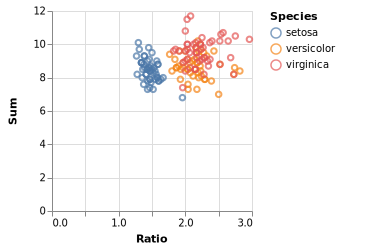

class: middle, centre
# JuliaDBMeta and StatPlots
## Metaprogramming tools for manipulating and visualizing data
Pietro Vertechi, JuliaCon 2018

---

# What is JuliaDBMeta?
g82eZhEVQvvZDem8bJPT3ib7eqBDsEvQJuzIDBnU9pdW0Lb4Nf
- JuliaDBMeta macros (inspired on DataFramesMeta and Query) allow to use the JuliaDB library for table manipulations with a simplified syntax
g82eZhEVQvvZDem8bJPT3ib7eqBDsEvQJuzIDBnU9pdW0Lb4Nf
- JuliaDBMeta operations can be concatenated, mixing and matching with external packages, to create a data analysis pipeline (both in memory and out-of-core)
g82eZhEVQvvZDem8bJPT3ib7eqBDsEvQJuzIDBnU9pdW0Lb4Nf
- JuliaDBMeta pipelines integrate smoothly with several plotting libraries (VegaLite, StatPlots, Gadfly)
g82eZhEVQvvZDem8bJPT3ib7eqBDsEvQJuzIDBnU9pdW0Lb4Nf
- the new Interact package allows to run these manipulations and visualizations from a "hackable" and composable GUI

---

# Exploiting JuliaDB's features

<div style="display: flex; orientation: row;">
    <div style="width: 47%; text-align:center;">
        <strong>JuliaDB</strong>
    </div>
    <div style="width: 6%;"></div>
    <div style="width: 47%; text-align:center;">
        <strong>JuliaDBMeta</strong>
    </div>
</div>
<div style="height: 1em;"></div>

g82eZhEVQvvZDem8bJPT3ib7eqBDsEvQJuzIDBnU9pdW0Lb4Nf

<div style="display: flex; orientation: row;">
    <div style="width: 47%;">
        Fully-typed tables
    </div>
    <div style="width: 6%;"></div>
    <div style="width: 47%;">
        Replace symbols with respective columns in a type-inferrable way
    </div>
</div>
<div style="height: 1em;"></div>

g82eZhEVQvvZDem8bJPT3ib7eqBDsEvQJuzIDBnU9pdW0Lb4Nf

<div style="display: flex; orientation: row;">
    <div style="width: 47%;">
        Fast row iteration &rarr; efficiently execute a function row by row (specifying which fields to materialize while iterating)
    </div>
    <div style="width: 6%;"></div>
    <div style="width: 47%;">
        Detect anonymous function and necessary fields
    </div>
</div>
<div style="height: 1em;"></div>

g82eZhEVQvvZDem8bJPT3ib7eqBDsEvQJuzIDBnU9pdW0Lb4Nf

<div style="display: flex; orientation: row;">
    <div style="width: 47%;">
        Parallel data storage and parallel computations
    </div>
    <div style="width: 6%;"></div>
    <div style="width: 47%;">
        Detect if user command can be parallelized automatically
    </div>
</div>

---

# Demo

```@example meta
using JuliaDBMeta
filepath = Pkg.dir("JuliaDBMeta", "test", "tables", "iris.csv")
iris = loadtable(filepath)
```

---

# Type stable column extraction

Each symbol gets replaced with the corresponding column:

```@example meta
@with iris :SepalLength .* :SepalWidth ./ mean(:SepalWidth)
```

---

# Type stable column extraction

```@example meta
using Base.Test
f(df) = @with df :SepalLength
@inferred f(iris)
```

---

# Fast row iteration

Apply a given expression row by row:

```@example meta
@map iris :SepalLength/:SepalWidth
```

---

# Fast row iteration: under the hood

```julia
@map iris :SepalLength/:SepalWidth
```
g82eZhEVQvvZDem8bJPT3ib7eqBDsEvQJuzIDBnU9pdW0Lb4Nf
* Construct anonymous function `t -> t.SepalLength / t.SepalWidth`
g82eZhEVQvvZDem8bJPT3ib7eqBDsEvQJuzIDBnU9pdW0Lb4Nf
* Store list of fields that are actually used: `(:SepalLength, :SepalWidth)`
g82eZhEVQvvZDem8bJPT3ib7eqBDsEvQJuzIDBnU9pdW0Lb4Nf
* Return:

```julia
map(t -> t.SepalLength / t.SepalWidth, iris, select = (:SepalLength, :SepalWidth))
```

---

# Fast row iteration: examples

The same trick can be used to add or modify one or more columns:

```@example meta
@transform iris {Ratio = :SepalLength/:SepalWidth}
```

---

# Fast row iteration: examples

The same trick can be used to add or modify one or more columns:

```julia
@transform iris {Ratio = :SepalLength/:SepalWidth}
```

or to select data:

```@example meta
@where iris :SepalLength == 4.9
```

---

# Fast row iteration: out-of-core

As each row-wise macro implements a local computation, it will be parallelized out of the box if the data is stored on several processors.

```@example meta
iris2 = table(iris, chunks = 2)
@where iris2 :SepalLength == 4.9
```

---

# Pipeline

Using `@apply` we can create a pipeline, i.e. a sequence of JuliaDBMeta macros or normal Julia / JuliaDB functions.

```@example meta
@apply iris begin
    @transform {Ratio = :SepalLength/:SepalWidth, Sum = :SepalLength+:SepalWidth}
    sort(_, :Ratio, rev = true)
    _[1:3]
end
```

---

# Pipeline: split-apply-combine

Sometimes the data is naturally divided into groups (for example the different `Species` of our dataset) and we may wish to apply the pipeline separately on each group

```@example meta
@apply iris :Species flatten=true begin
    @transform {Ratio = :SepalLength/:SepalWidth, Sum = :SepalLength+:SepalWidth}
    sort(_, :Ratio, rev = true)
    _[1:3]
end
```

---

# Pipeline: out of core

We can run our pipeline in parallel, splitting by chunks on the various processors:

```@example meta
@applychunked iris2 begin
    @transform {Ratio = :SepalLength/:SepalWidth, Sum = :SepalLength+:SepalWidth}
    sort(_, :Ratio, rev = true)
    _[1:3]
end
```

---

# Pipeline: out of core Query support

The functions in the `@applychunked` pipeline are run on normal in-memory table chunks, so one can put anything that works for in-memory tables (e.g Query operators).

```@example meta
import Query

@applychunked iris2 begin
    @transform {Ratio = :SepalLength/:SepalWidth, Sum = :SepalLength+:SepalWidth}
    Query.@orderby_descending(_.Ratio)
    Query.@take(3)
    table
end
```

---

# Pipeline: plotting

The pipeline has support for plotting via external packages, provided they accept JuliaDB tables as input:

```julia
using StatPlots
@apply iris begin
    @transform {Ratio = :SepalLength/:SepalWidth, Sum = :SepalLength+:SepalWidth}
    @df corrplot([:Ratio :Sum])
end
```


---

# Pipeline: plotting

The pipeline has support for plotting via external packages, provided they accept JuliaDB tables as input:

```julia
using VegaLite
@apply iris begin
    @transform {Ratio = :SepalLength/:SepalWidth, Sum = :SepalLength+:SepalWidth}
    @vlplot(:point, x = :Ratio, y = :Sum, color = :Species)
end
```


---

# Interactivity

The [Interact](https://github.com/JuliaGizmos/Interact.jl) and [TableWidgets](https://github.com/piever/TableWidgets.jl) packages allow the creation of interactive user interfaces based on JuliaDBMeta and StatPlots:

<iframe src="../pipeline.mp4" width="640" height="360" frameborder="0" webkitallowfullscreen mozallowfullscreen allowfullscreen></iframe>


---

# Acknowledgments

- The JuliaPlots organization (where I started contributing to the Julia package ecosystem) for patiently guiding me through my first PRs

- My GSoC mentor Shashi Gowda for his help both on JuliaDB and on the interactive apps

- The JuliaCon organizers
