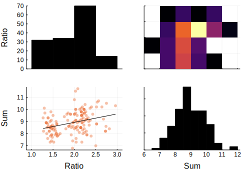

class: middle, centre
# JuliaDBMeta and StatPlots
## Metaprogramming tools for manipulating and visualizing data
Pietro Vertechi, JuliaCon 2018

---

# Outline

- JuliaDBMeta: a pure Julia package (inspired on DataFramesMeta and Query) that uses metaprogramming to simplify operations on tabular data
g82eZhEVQvvZDem8bJPT3ib7eqBDsEvQJuzIDBnU9pdW0Lb4Nf
- Using metaprogramming, it is possible to pipe this data directly into the StatPlots package, for statistical visualizations
g82eZhEVQvvZDem8bJPT3ib7eqBDsEvQJuzIDBnU9pdW0Lb4Nf
- Thanks to the InteractBase package, it is possible to access these tools from a "hackable" and composable GUI

---
# Exploiting JuliaDB's technical advantages

<div style="display: flex; orientation: row;">
    <div style="width: 47%; text-align:center;">
        <strong>JuliaDB</strong>
    </div>
    <div style="width: 6%;"></div>
    <div style="width: 47%; text-align:center;">
        <strong>JuliaDBMeta</strong>
    </div>
</div>
<div style="height: 1em;"></div>

g82eZhEVQvvZDem8bJPT3ib7eqBDsEvQJuzIDBnU9pdW0Lb4Nf

<div style="display: flex; orientation: row;">
    <div style="width: 47%;">
        Fully-typed tables with type stable column extraction
    </div>
    <div style="width: 6%;"></div>
    <div style="width: 47%;">
        Replace symbols with respective column at macroexpand time
    </div>
</div>
<div style="height: 1em;"></div>

g82eZhEVQvvZDem8bJPT3ib7eqBDsEvQJuzIDBnU9pdW0Lb4Nf

<div style="display: flex; orientation: row;">
    <div style="width: 47%;">
        Fast row iteration
    </div>
    <div style="width: 6%;"></div>
    <div style="width: 47%;">
        Detect necessary variables and anonymous function
    </div>
</div>
<div style="height: 1em;"></div>

g82eZhEVQvvZDem8bJPT3ib7eqBDsEvQJuzIDBnU9pdW0Lb4Nf

<div style="display: flex; orientation: row;">
    <div style="width: 47%;">
        Parallel data storage and parallel computations
    </div>
    <div style="width: 6%;"></div>
    <div style="width: 47%;">
        Detect if user command can be parallelized automatically
    </div>
</div>

---

# Demo

```@example meta
using JuliaDBMeta
filepath = Pkg.dir("JuliaDBMeta", "test", "tables", "iris.csv")
iris = loadtable(filepath)
```

---

# Type stable column extraction

Each symbol gets replaced with the corresponding column:

```@example meta
@with iris :SepalLength .* :SepalWidth ./ mean(:SepalWidth)
```

---

# Type stable column extraction

```@example meta
using Base.Test
f(df) = @with df :SepalLength
@inferred f(iris)
```

---

# Fast row iteration

Apply a given expression row by row:

```@example meta
@map iris :SepalLength/:SepalWidth
```

---

# Fast row iteration: under the hood

```julia
@map iris :SepalLength/:SepalWidth
```
g82eZhEVQvvZDem8bJPT3ib7eqBDsEvQJuzIDBnU9pdW0Lb4Nf
* Construct anonymous function `t -> t.SepalLength / t.SepalWidth`
g82eZhEVQvvZDem8bJPT3ib7eqBDsEvQJuzIDBnU9pdW0Lb4Nf
* Store list of fields that are actually used: `(:SepalLength, :SepalWidth)`
g82eZhEVQvvZDem8bJPT3ib7eqBDsEvQJuzIDBnU9pdW0Lb4Nf
* Return:

```julia
map(t -> t.SepalLength / t.SepalWidth, iris, select = (:SepalLength, :SepalWidth))
```

---

# Fast row iteration: examples

The same trick can be used to add a new column:

```@example meta
@transform iris {Ratio = :SepalLength/:SepalWidth}
```

---

# Fast row iteration: examples

The same trick can be used to add or modify a column:

```julia
@transform iris {Ratio = :SepalLength/:SepalWidth}
```

or to select data:

```@example meta
@where iris :SepalLength == 4.9 && :Species == "setosa"
```

---

# Fast row iteration: out-of-core

As each row-wise macro implements a local computation, it will be parallelized out of the box if the data is stored on several processors.

```@example meta
iris5 = table(iris, chunks = 5)
@where iris5 :SepalLength == 4.9 && :Species == "setosa"
```

---

# Pipeline

To understand out-of-core support in JuliaDBMeta we need to digress and look at the concept of a pipeline: a sequence of JuliaDBMeta macros or normal Julia / JuliaDB functions.

```@example meta
@apply iris begin
    @map {Ratio = :SepalLength/:SepalWidth, Sum = :SepalLength + :SepalWidth}
    sort(_, :Ratio, rev = true)
    _[1:2]
end
```

---

# Pipeline: out of core

We can use the same idea to run our pipeline in parallel on each cluster:

```@example meta
@applychunked iris5 begin
    @map {Ratio = :SepalLength/:SepalWidth, Sum = :SepalLength + :SepalWidth}
    sort(_, :Ratio, rev = true)
    _[1:2]
end
```

---

# Pipeline: grouping

The same trick can also be used to analyze grouped data:

```@example meta
@apply iris :Species flatten=true begin
    @map {Ratio = :SepalLength/:SepalWidth, Sum = :SepalLength + :SepalWidth}
    sort(_, :Ratio, rev = true)
    _[1:2]
end
```

---

# Pipeline: plotting

The pipeline has support for plotting via StatPlots and the `@df` macro:

```julia
using StatPlots
@apply iris begin
    @map {Ratio = :SepalLength/:SepalWidth, Sum = :SepalLength+:SepalWidth}
    @df corrplot([:Ratio :Sum])
end
```


---

# Interactivity

The [Interact](https://github.com/JuliaGizmos/Interact.jl) and [TableWidgets](https://github.com/piever/TableWidgets.jl) package allows the creation of interactive user interfaces based on JuliaDBMeta and StatPlots:

<iframe src="../pipeline.mp4" width="640" height="360" frameborder="0" webkitallowfullscreen mozallowfullscreen allowfullscreen></iframe>


---

# Acknowledgments

- The JuliaPlots organization (where I started contributing to the Julia package ecosystem) for patiently guiding me through my first PRs

- My GSoC mentor Shashi Gowda for his help both on JuliaDB and on the interactive apps

- The JuliaCon organizers
